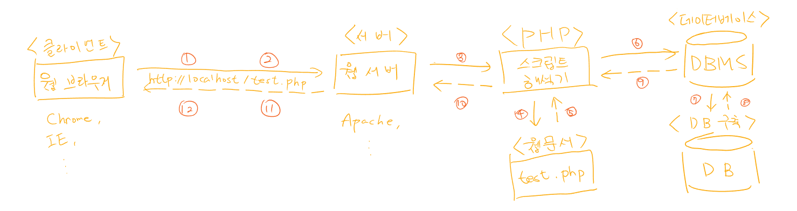

# PHP (Professional HTML Preprocessor)

## Contents

### [1. PHP vs. JSP vs. ASP](#1-php-jsp-asp)
### [2. PHP 웹 구동방식](#2-php-웹-구동-원리)
### [3. PHP 시작과 끝](#3-php의-시작과-끝)   
### [4. PHP 주석처리](#4-php에서의-주석처리)
### [5. PHP 출력문](#5-출력문)
### [6. PHP 스크립트 중단](#6-스크립트-중단)
### [7. PHP와 HTML 관계](#7-php와-html의-관계)
### [8. PHP 자료형(Data Type)](#8-자료형data-type)
### [9. PHP 변수(Variables)](#9-변수-variables)
### [10. PHP 상수(Constants)](#10-상수-constants--변하지-않는-값)
### [11. PHP 연산자(Operators)](#11-연산자-operators)
### [12-1. PHP 조건문 1 _ IF문](#12-1-조건문if--elseif-else)
### [12-2. PHP 조건문 2 _ SWITCH문](#12-2-조건문-switch--case-문)
### [12-3. PHP 조건문 3 _ 삼항연산자](#12-3-ternary-operator-삼항연산자)
### [13-1. PHP 반복문 1 _ FOR문과 FOREACH문](#13-1-반복문for-foreach)
### [13-2. PHP 반복문 2 _ WHILE문과 DO~WHILE문](#13-2-반복문while-do--while)


<br><br>
## [메인페이지로 되돌아가기](README.md)
<br>

-----

## 1. PHP? JSP? ASP?   

```
- PHP (Personal Hypertext Preprocessor)   

: PHP는 1994년 Rasmus Lerdort가 개인 홈페이지를 만들기 위해 처음 고안하였으며 현재 세계에서 가장 많이 사용하고 있는 아파치 웹 서버에 모듈형태로 장착되어 활용되고 있다.
PHP는 서버의 운영체제가 윈도우뿐만 아니라 유닉스와 리눅스 운영체제에서도 사용이 가능한 서버측 스크립트 언어이다.

PHP는 JSP의 JDBC나 ASP의 ODBC와 같은 보조적인 메커니즘을 사용하지 않고 함수를 통하여 바로 처리될 수 있는 방식을 채택하고 있어 초보자가 웹 언어를 배우기에 가장 적합한 장점을 지니고 있다.
그리고 모든 데이터베이스에 대해 자체 라이브러리를 지원하고 있기 때문에 다양한 데이터베이스(Oracle, MySQL, dbase, Informix, unix dbm 등)를 활용할 수 있다.

PHP는 C언어를 기반으로 만들어져 서버에서 실행되는 스크립트언어로 C언어에 자신있는 개발자들에게는 보다 쉽게 접근할 수 있다는 장점이 있지만, 컴포넌트를 사용할 수 없는 점과 취약한 보안을 강구해야 하는 단점이 존재한다.
그렇지만, 빠른 생산성과 저렴한 유지비용으로 프로그래밍 속도를 높여준다는 매력적인 부분 또한 존재하기 때문에 많이 사용되고 있다.
```

<br>

```
- JSP (Java Server Page)

: JSP는 Sun Microsystems사에서 만든 웹 언어이며 순수한 자바를 기반으로 한 스크립트 언어이다.
기존의 HTML에 프로그램 언어를 사용할 수 있게 하는 기술을 접목하여 컴파일 등의 역할을 서버 측에서 담당하도록 하는 방식으로 구현된다.

JSP는 일반적인 웹 페이지의 형태를 나타내는 HTML 태그로 구현되는 부분과 웹 페이지를 동적으로 생성하는 서버측 프로그램 즉, 서블릿을 수행하도록 JSP 태그로 구현되는 부분으로 소스가 생성되어 처리된다.
또한, JavaBeans 지원기증을 사용하여 정보를 최종 사용자에게 보여주는 프레젠테이션과 사용자들에게 보여주기 위해 사용되는 코드의 프로그램 구현이 완벽하게 분리될 수 있으며 Java 언어를 활용하여 동적 컨텐츠를 구현할 수 있다.

JSP는 서블릿 기술을 활용한 수행 흐름으로 서버에서의 수행능력이 뛰어나며 플랫폼과 웹 서버에 독립적으로 구현 가능하다는 장점이 있다.
또한, 컴포넌트를 활용하여 프레젠테이션 부분과 프로그램 기능 구현 부분으로 분리하여 개발 할 수 있으며 자바의 특징을 그대로 사용할 수 있다는 장점이 있는 반면, 코딩이 어렵고 ASP에 비해 코드를 입력해야 하는 양이 1.5배가량 더 많다는 단점이 존재한다.
그렇지만, JVM(Java Virtual Machine)이라는 프로그램이 운영체제 위에 설치되어 가동되면 모든 운영체제(유닉스, 리눅스, 윈도우)에서 사용할 수 있기 때문에 코딩이 어려워도 많이 사용되고 있는 추세이다. 
```

```
- ASP (Active Server Page)

: ASP는 Microsoft사에서 개발한 웹 언어로서 윈도우용에서만 제작 가능한 플랫폼을 지원하고 있으며 윈도우 2000 서버의 IIS(Internet Information Server) 또는 윈도우 98/ME의 PWS(Personal Web Server)만을 지원한다.
사용되는 언어로는 비주얼베이직이나 자바이며 OLE(Object Linking and Embedding) 데이터베이스를 기반으로 ADO(Active Data Objects)의 연결은 MS-SQL 데이터베이스를 사용한다.

ASP는 Microsoft사에서 만든 Visual Basic 언어를 기반으로 스크립트 방식을 사용하여 동적인 웹페이지를 작성할 수 있도록 지원한다.
쉽게 표현하면 서버에서 실행하는 스크립트 언어를 의미하며 ActiveX를 제공하는 컴포넌트를 사용하거나 직접 개발하기 위한 기능도 제공한다.

ASP의 장점은 적당히 빠른 생산성과 편리성을 들 수 있으며 MS사에서 개발한 MS-SQL을 적용하기가 편리하다.
윈도우 운영체제 기반에서 구동되므로 유지보수 측면에서는 수월하며 비즈니스 로직을 구현하기에도 편리함을 제공한다.

하지만, ASP는 구축과정에서 높은 비용을 투자해야 한다는 단점이 있다.
그 이유는 특정한 기능을 구현하려면 컴포넌트를 구입해야 한다는 점이다.
무엇보다도 ASP의 치명적인 단점을 꼽는다면 특정 플랫폼과 특정 웹 서버(IIS)에서만 동작한다는 부분과 PHP보다 코딩양이 많다는 점이다.
```

<br><br>

### [Contents 목록으로 되돌아가기](#contents)

<br>

-----

## 2. PHP 웹 구동 원리   

### 웹 DB 프로그래밍 언어와 HTML의 차이점 

웹서버가 구축된 환경에서 결과를 보여주는 PHP와 웹서버의 존재 유무를 무시하고 결과 화면을 웹브라우저를 통해 보여주는 HTML는 커다란 차이가 있다.   

HTML은 클라이언트 측에서 실행되고 결과 화면을 나타내지만, PHP는 웹서버가 반드시 구축되어 있어야만 결과 화면을 볼 수가 있다. 그 이유는 서버 측에서 명령의 해석을 하고 클라이언트 측(웹 브라우저)에 결과를 보내지는 과정을 거치기 때문이다.

<br>

### PHP에서의 웹 서버와 클라이언트 동작 원리




① 웹 브라우저에서 http://localhost 또는 http://127.0.0.1을 입력한다.

② 이미 저장되어 있는 웹 문서 'test.php'가 있다면 웹 서버에게 요청한다. (http://localhost/test.php)

③ 웹 서버는 PHP에게 저장되어 있는 test.php 파일을 전송 요청한다.

④ PHP는 저장되어 있는 test.php 파일을 찾는다.

⑤ 찾은 test.php 파일을 클라이언트가 볼 수 있도록 해석한다.

⑩ PHP는 해석된 test.php 파일을 웹 서버에게 전송한다.

⑪ 웹 서버는 해석된 파일을 http://localhost/test.php로 클라이언트에게 전송한다.

⑫ 클라이언트는 웹 브라우저를 통해 test.php 파일의 결과 화면을 본다.


<br><br>

### [Contents 목록으로 되돌아가기](#contents)

<br>

-----

## 3. PHP의 시작과 끝    

### - php의 시작

```
<?php
```

-> php의 시작을 나타낸다.

### - php의 끝 

```
?>
```

-> php의 끝을 나타낸다.   
-> php만 단독으로 쓰일 땐 생략 가능하다. 

<br>

*참고

```
1. <? ... ?>  // 보편적인 방법

2. <?php ... ?>  // XML이나 XHTML 안에 PHP 코드를 내장시켜 사용할 때의 방법

3. <script language = "php"> ... </script>  // PHP가 스크립트 언어임을 표현하는 방법
```

-> XML이나 XHTML 안에 PHP 코드를 내장시켜 사용하고자 할 때는 확실한 구분을 위해 <?php ...?>형을 사용하는 것이 좋다.


<br><br>

### [Contents 목록으로 되돌아가기](#contents)

<br>

-----


## 4. PHP에서의 주석처리   

### - 한 줄 주석

```
// 한 줄 주석입니다.
# 한 줄 주석입니다.
```

### - 여러 줄 주석

```
/*
여러 줄 주석입니다.
여러 줄 주석입니다.
여러 줄 주석입니다.
여러 줄 주석입니다.
여러 줄 주석입니다.
*/
```

<br><br>

### [Contents 목록으로 되돌아가기](#contents)

<br>

-----

## 5. 출력문   

```
- echo
- print
```

-> C언어의 printf() 함수와 같은 의미로, 대소문자를 구별하지 않는다.


<br><br>

### [Contents 목록으로 되돌아가기](#contents)

<br>

-----

## 6. 스크립트 중단   

```
- exit
- die
```

-> 기점으로 스크립트가 중단된다.


<br><br>

### [Contents 목록으로 되돌아가기](#contents)

<br>

-----

## 7. PHP와 HTML의 관계   

HTML 안에 PHP 태그를 첨부할 수 있다.
PHP는 열기 태그 "<?php"에서부터 닫기 태그 "?>"까지 발견된 코드를 해석하고, 닫기 태그 이후에 작성된 태그는 그냥 넘겨주기 때문에 PHP 태그 영역과 외부는 완전히 독립적으로 존재하게 된다.
이러한 방법으로 HTML 안에 PHP 코드를 첨부할 수 있도록 해준다.

```
<html>
    <head>
        <title> HTML 안에 PHP 첨부하기 </title>
    </head>
    <body>
        <h1>
            <?php
                echo 'Hello, world';
            ?>
        </h1>
    </body>
</html>
```

<br><br>

### [Contents 목록으로 되돌아가기](#contents)

<br>

-----

## 8. 자료형(Data Type)   

- String Type : 문자열형 변수

```
'Hello, world'
"Hello, world"
```


- Null Type : 값이 할당이 안된 상태(임시값)

-> Type Casting 불가능


- Integer Type (Int) : 정수형 변수

```
10;  // Decimal
0777;  // Octal
0xF;  // Hexdecimal
0b0101;  // Binary
```


- Floating point number Type (float, double) : 실수형 변수

```
1.234;
1.2e3;
7E-3;
```


- Boolean Type

```
true;
false;
```


- Array (배열) : 동일한 이름의 변수를 여러 개 저장

```
- Define Array

$fruits = [
    'apple',
    'banana',
    'grape'
];

$fruits = array('apple', 'banana', 'grape');


- Define Array with key

$fruits = [
    0 => 'apple',
    'fruit' => 'banana'
];


- Destructuring : 비구조화 할당

list($fruit) = $fruits;  // apple
[$fruit] = $fruits;
[0 => $fruit] = $fruits;

list(, $fruit) = $fruits;  // banana
[, $fruit] = $fruits;
['fruit' => $fruit] = $fruits
```

** CRUD

- Insert

```
$fruits[] = 'orange';
$fruit[3] = 'orange';

/*
array(4) {
    [0] => "apple"
    [1] => "banana"
    [2] => "grape"
    [3] => "orange"
}
*/
```


- Select

```
echo $fruit[3];  // orange
```


- Update

```
$fruit[3] = 'melon';

echo $fruit[3];  // melon
```


- Delete

```
unset($fruits[3]);

echo $fruits[3];  // Error: Undefine offset
```


** Spread Operator in Array Expression (PHP 7.4 이상)

```
$fruits = [
    'apple',
    'banana',
    'orange'
];

// 가장 위에 있는 배열과 가장 밑에 있는 배열은 같은 배열입니다.

$fruits = [
    'apple'
];

$fruits = [
    ...$fruits,
    'banana',
    'orange'
];


-> 배열의 분리, 병합 등에 유리합니다.
```

### Type Casting (데이터형 변환)

```
(string) 10;  // "10"
(string) true;  // "1"
(string) false;  // ""
(string) 1.234;  // "1.234"

(int) 'Hello, world';  // 0
(int) '50x';  // 50
(int) ture;  // 1
(int) false;  // 0
(int) null;  // 0

(bool) 10;  // true
(bool) [];  // false
(bool) '';  // false
(bool) null;  // false
```


<br><br>

### [Contents 목록으로 되돌아가기](#contents)

<br>

-----

## 9. 변수 (Variables)   

```
- Define Variables

$message = 'Hello, world';  // String
$count = 0;  // Int
$pi = 3.14;  // Double
$isVisited = false;  // Boolean
$temp = null;  // Null 


- Using Variables

$message;


- Using Variables in String

// The message is Hello, world
"The message is $message";
"The message is {$message}";

// The message is {$message}
'The message is {$message}';


-> 변수와 함께 사용하고 싶을 땐, 큰 따옴표(")와!


- Here Doc, Now Doc : 여러줄의 문자열을 처리할 때 용이

* Here Doc : 변수 인지 가능

echo <<<HTML
<html>
    <head>
        <title>$message</title>
    </head>
</html>
HTML;

/*
<html>
    <head>
        <title>Hello, world</title></title>
    </head>
</html>
*/


* Now Doc : 변수 인지 불가

echo <<<'HTML'
<html>
    <head>
        <title>$message</title>
    </head>
</html>
HTML;

/*
<html>
    <head>
        <title>$message</title>
    </head>
</html>
*/


- Free : 메모리에 할당된 변수를 리로드

unset($message)


- 가변 변수 (Variable variables)

$varName = 'message';
// $message = 'Hello, world';
$$varName = 'Hello, world';
${$varName} = 'Hello, world';

-> 필요할 때만 사용하기!
```


<br><br>

### [Contents 목록으로 되돌아가기](#contents)

<br>

-----

## 10. 상수 (Constants) : 변하지 않는 값   

```
- Define Constants

const CONSTANT = 'Hello, World';  // 요즘 방식
define('CONSTANT', 'Hello, World');  // 옛날 방식


* Magic Constants : PHP 내부에 미리 정의 되어있는 상수

__FILE__;  // 현재 파일의 전체경로와 파일명을 반환
__LINE__;  // 파일의 현재 줄 번호
__DIR__;  // 현재 파일이 속해있는 디렉토리를 반환
__FUNCTION__;  // 정의된 그대로의 함수명 반환 (대소문자 구분)
__CLASS__;  // 정의된 그대로의 클래스명 반환 (대소문자 구분)
__METHOD__;  // 정의된 그대로의 메소드명 반환 (대소문자 구분)
__NAMESPACE__;  // 현재 네임스페이스의 이름 (대소문자 구분) 이 상수는 컴파일을 할 경우에 정의됨
```


<br><br>

### [Contents 목록으로 되돌아가기](#contents)

<br>

-----

## 11. 연산자 (Operators)

```
- String Operators (문자열 연산자)

ehco 'Hello, ' . 'world';  // Hello, world


- Null coalescing

$message = null;
echo $message ?? 'Hello, world';  // Hello, world

$message = 1;
echo $message ?? 'Hello, world';  // 1

-> message가 null 이면 다음 줄을 반환해주고 null이 아니면 message 값을 반환해준다.


- Logical Operators (논리 연산자)


// and -> 둘 다 true여야 true

true and true;  // true
true && true;  // true

// or -> 하나만 true여도 true

true or false;  // true
true || true;  // true

// xor -> 둘이 달라야 true

true xor false;  // true
true xor true;  // false
false xor false;  // false

// not -> 논리연산의 값을 반대로 뒤집음

!true;  // false


- Comparison Operators (비교 연산자)

10 == 10;  // true, 값만 비교
10 == '10';  // true

10 === 10;  // true, 자료형까지 비교(Type Check)
10 === '10';  // false

10 != 10;  // false, 값만 비교
10 != '10';  // false
10 <> 20;  // true

10 !== 10;  // false, 자료형까지 비교(Type Check)
10 !== '10';  // true

10 > 20;  // false
10 >= 20;  // false
10 < 20;  // true
10 <= 20;  // true
'ab' < 'ac';  // true

10 <=> 20;  // Spaceship Operators: 크면 1을, 같으면 0을, 작으면 -1을 반환, -1
10 <=> 10;  // 0
30 <=> 20;  // 1


- Bitwise Operators (비트연산자)

$bin = 0b0101;  // 5

$bin | 0b0100;  // 0b0101, 5
$bin & 0b0100;  // 0b0100, 4
$bin ^ 0b0100;  // 0b0001, 1
$bin << 1;  // 0b1010
$bin >> 1;  // 0b0010
~$bin;  // 0b1010, -6
```

```
- Arithmetic Operators (산술 연산자)

2 + 2;  // 덧셈 연산자, 4
4 - 2;  // 뺄셈 연산자, 2
10 / 3;  // 나눗셈 연산자, 3.333
5 * 2;  // 곱셈 연산자, 10
4 % 3;  // 나머지 연산자, 1
2 ** 4;  // 거듭제곱 연산자, 16


- Incrementing / Decrementing Operators (증감연산자)

// 후위증감연산자($count++ / $count--)
: 변수 $count의 값을 먼저 반환하고, 1을 증가시킨다. / 1을 감소시킨다.

$count = 0;
echo $count++;  // 0
echo $count;  // 1

$count = 0;
echo $count--;  // 0
echo $count;  // -1

// 전위증감연산자(++$count / --$count)
: 먼저 1을 증가시키고 / 먼저 1을 감소시키고, 변수 $count를 반환한다.

$count = 0;
echo ++$count;  // 1

$count = 0;
echo --$count;  // -1


- Assignment Operators (할당 연산자, 대입 연산자)
: =, +=, -=, /=, *=, %=, **=, &=, |=, ^=, <<==, >>==, .=

$count = 0;
$count += 1;  // $count = $count + 1;,  1


- Operator Precedence (연산자 우선순위)
: Comparison > Logical 
```

<br><br>

### [Contents 목록으로 되돌아가기](#contents)

<br>

-----

## 12-1. 조건문(if ~ elseif, else)

```
* false 참고 : [], '', false, 0, null

- if 문

if (true) {
    ehco 'Hello, world';
}  // Hello, world

// Alternative Syntax
if (true):
    ehco 'Hello, world';
endif;


- if ~ else 문

if (false) {
    ehco 'Hello, world';
} else {
    ehco 'Bye';
}  // Bye

// Alternative Syntax
if (false):
    ehco 'Hello, world';
else:
    ehco 'Bye';
endif;


- 다중 if 문(if ~ elseif ~ else 문)

if (false) {
    ehco 'Hello, world';
} elseif (true) {
    ehco 'Who are you?';
} else {
    ehco 'Bye';
}  // Who are you?

// Alternative Syntax
if (false):
    ehco 'Hello, world';
elseif (true):
    ehco 'Who are you?';
else:
    ehco 'Bye';
endif;


- Define Variables in If Context
: If문에서 변수 할당

if ($message = 'Hello, world') {
    echo $message;
}  // Hello, world

```

<br><br>

### [Contents 목록으로 되돌아가기](#contents)

<br>

-----

## 12-2. 조건문 (Switch ~ case 문)

```
- Switch ~ case 문

$context = 1;

switch ($context) {
    case 1:
        ehco 'Hello, world';
        break;
    case 2:
        ehco 'Who are you?';
        break;
    default:
        ehco 'Bye';
}  // Hello, world

// Alternative Syntax
switch ($context):
    case 1:
        ehco 'Hello, world';
        break;
    case 2:
        ehco 'Who are you?';
        break;
    default:
        ehco 'Bye';
endswitch;

/*
Switch ~ case -> If

if ($context == 1) {
    ehco 'Hello, world';
} elseif ($context == 2) {
    ehco 'Who are you?';
} else {
    ehco 'Bye';
}  // Who are you?
*/


* IF 문 => 조건을 검사할 때 사용!
* SWITCH ~ CASE 문 => 선택을 해야할 때 사용!
```

<br><br>

### [Contents 목록으로 되돌아가기](#contents)

<br>

-----

## 12-3. Ternary Operator (삼항연산자)

```
ehco true ? 'Hello, world' : 'Bye';  // Hello, world

ehco false ? 'Hello, world' : 'Bye';  // Bye


* echo 'Hello, world' ?: 'Bye';
// 앞의 값이 참이면 앞의 것을 return, 거짓이면 뒤의 값을 return한다.
/*
즉,
'Hello, world' ? 'Hello, world' : 'Bye';
와 일맥상통하는 Syntax 이다.
*/
```

<br><br>

### [Contents 목록으로 되돌아가기](#contents)

<br>

-----

## 13-1. 반복문(for, foreach)

```
- for

/*
for (초기값; 조건식; 증감값) {
    반복 수행할 문장 또는 명령;
}
*/

for ($i = 1; $ <= 10; $i++) {
    ehco '{$i} 번째 출력 <br>';
}


- for with array

$messages = [
    'Hello, world',
    'Who are you?',
    'Bye'
];

for ($i = 0; $i < count($messages); $i++) {
    echo $message[$i] . PHP_EOL;
}


- foreach (as [$key => ] $value)

$response = [
    'name' => 'PHP',
    'catagoryId' => 0,
    'messages' => 'Hello, world'
];

foreach ($response as $key => $value) {
    echo $value . PHP_EOL;
}

// key 값은 생략 가능
foreach ($response as $value) {
    echo $value . PHP_EOL;
}

/*
PHP
0
Hello, world
*/


$response = [
    'messages' => [
        'Hello, world',
        'Who are you?',
        'Bye',
    ],
];

foreach ($response as $key => $value) {
    foreach ($value as $msg) {
        echo $msg . PHP_EOL;
    }
}

/*
Hello, world
Who are you?
Bye
*/
```

<br><br>

### [Contents 목록으로 되돌아가기](#contents)

<br>

-----

## 13-2. 반복문(while, do ~ while)

```
- while 문

for ($i = 1; $i < 10; $i++) {
    ehco $i;  // 123456789
}


$i = 1;
while ($i < 10) {
    ehco $i++;
}  // 123456789

/*
초기값;
while (조건식) {
    반복 수행할 문장 또는 명령;
    증감값;
}
*/


=> for문은 끝이 정해져있는 경우에! 그렇지 않은 경우는 while문을 많이 쓴다!
```

```
- do ~ while 문

$i = 1;
do {
    echo $i++;
} while ($i < 10);  // 123456789

/*
초기값;
do {
    반복수행할 문장 또는 명령
    증감값;
} while (조건식);
*/

=> while문 같은 경우엔 조건을 먼저 확인하고 실행하지만, do~while문은 먼저 실행하고 조건을 확인한다.
즉, do~while문은 while문과 비슷하지만 조건의 참, 거짓을 검사하기도 전에 무조건 한 번은 명령을 수행한다는 차이점이 있다.
```

```
- break [Level]
: 반복문을 탈출할 때 사용

-> Level 값에 따라 안쪽부터 Level개의 반복문을 탈출한다.

- continue [Level]
: 반복문의 조건문으로 이동할 때 사용 

-> Level 값에 따라 안쪽부터 Level번째의 반복문의 조건문으로 이동한다.
```
<br><br>

### [Contents 목록으로 되돌아가기](#contents)

<br>

-----


<br><br>

### [Contents 목록으로 되돌아가기](#contents)

<br>

-----


<br><br>

### [Contents 목록으로 되돌아가기](#contents)

<br>

-----


<br><br>

### [Contents 목록으로 되돌아가기](#contents)

<br>

-----